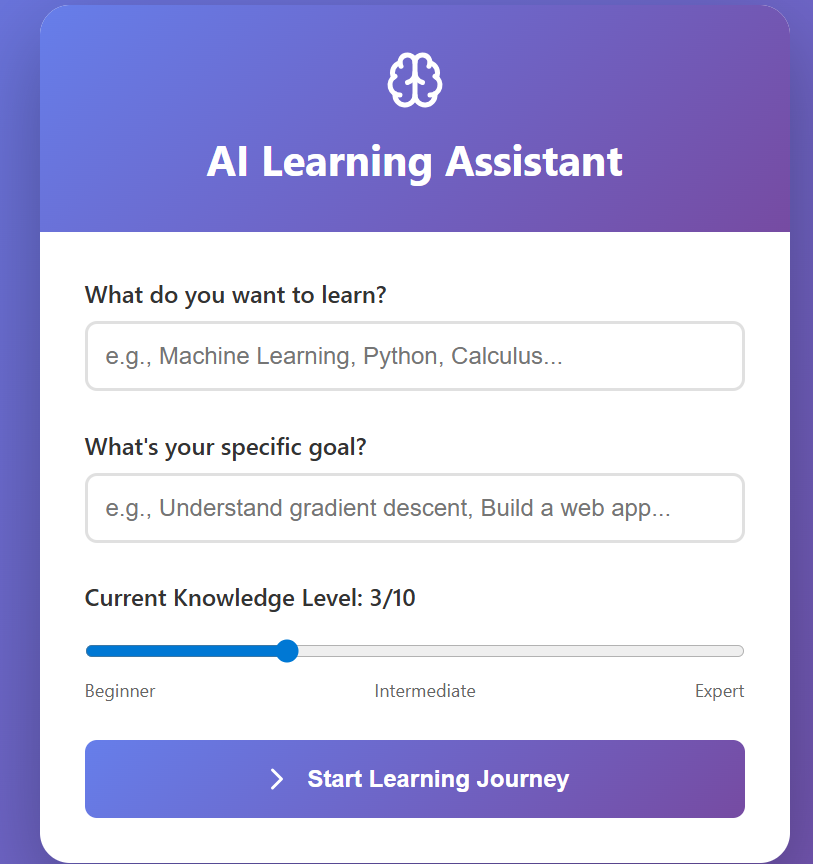

 🎓 Multi-Agent Education System with RAG

An intelligent tutoring system powered by multiple AI agents that work together to create personalized learning experiences. Built with LangGraph for agent orchestration, Qdrant for vector storage, Redis for caching, and Groq's LLMs for content generation.


## ✨ Features

- **🤖 Multi-Agent Architecture**: Specialized agents for tutoring, quiz generation, research, and progress tracking
- **🧠 RAG (Retrieval Augmented Generation)**: Context-aware responses using vector similarity search
- **📊 Adaptive Learning**: Difficulty adjusts based on student performance
- **💾 Persistent Sessions**: Redis caching maintains learning progress across sessions
- **🎯 Personalized Content**: Explanations and quizzes tailored to understanding level
- **📈 Progress Analytics**: Comprehensive tracking of learning journey

## 🏗️ System Architecture
```
User Interface (React)
↓
FastAPI Backend
↓
Orchestrator Agent (LangGraph)
↓
┌────────────────────┐
│  Distributed Agents │
├────────────────────┤
│ • Tutor Agent      │ ←→ Vector Store (Qdrant)
│ • Quiz Agent       │ ←→ LLM (Groq/Llama)
│ • Research Agent   │ ←→ Redis Cache
│ • Tracker Agent    │
└────────────────────┘
```
## 📁 Project Structure
```
education-agent-system/
├── backend/
│   ├── app/
│   │   ├── agents/
│   │   │   ├── orchestrator.py    # Master coordinator using LangGraph
│   │   │   ├── tutor_agent.py     # Generates adaptive explanations
│   │   │   ├── quiz_agent.py      # Creates and evaluates quizzes
│   │   │   ├── research_agent.py  # Finds learning materials
│   │   │   └── tracker_agent.py   # Monitors progress & analytics
│   │   ├── tools/
│   │   │   ├── llm_client.py      # Groq/LLM interface with caching
│   │   │   ├── vector_store.py    # Qdrant operations for RAG
│   │   │   └── redis_cache.py     # Session & response caching
│   │   ├── main.py                # FastAPI application
│   │   ├── models.py              # Pydantic models
│   │   └── config.py              # Configuration management
│   ├── docker-compose.yml         # Qdrant + Redis services
│   ├── requirements.txt           # Python dependencies
│   └── .env                       # API keys and configuration
├── frontend/
│   ├── src/
│   │   ├── App.js                # Main React component
│   │   └── App.css               # Styles
│   ├── public/
│   └── package.json
└── README.md
```

## 🚀 Quick Start

### Prerequisites

- Python 3.10+
- Node.js 18+
- Docker Desktop
- Groq API key (free from [console.groq.com](https://console.groq.com))

### Installation

1. **Clone the repository**
```bash
git clone https://github.com/yourusername/education-agent-system.git
cd education-agent-system

Backend Setup

bashcd backend
python -m venv venv
source venv/bin/activate  # On Windows: venv\Scripts\activate
pip install -r requirements.txt

# Create .env file
echo "GROQ_API_KEY=your_groq_api_key_here" > .env

Start Docker Services

bashdocker-compose up -d

Frontend Setup

bashcd ../frontend
npm install
Running the Application
Terminal 1 - Backend:
bashcd backend
source venv/bin/activate
uvicorn app.main:app --reload
Terminal 2 - Frontend:
bashcd frontend
npm start
Access the application:

Frontend: http://localhost:3000
API Documentation: http://127.0.0.1:8000/docs
Qdrant Dashboard: http://localhost:6333/dashboard

📸 Screenshots
Learning Interface




Adaptive explanations based on student level
Quiz System


Dynamic quiz generation with immediate feedback
Material


Progress Tracking


Comprehensive analytics and learning insights
🔧 Configuration
Environment Variables
Create a .env file in the backend directory:
env# LLM Configuration
GROQ_API_KEY=gsk_your_key_here
DEFAULT_LLM=groq

# Vector Database
QDRANT_URL=localhost
QDRANT_PORT=6333
COLLECTION_NAME=education_materials

# Redis Cache
REDIS_URL=redis://localhost:6379

# Database (optional)
DATABASE_URL=sqlite:///./education.db
Supported LLM Providers

Groq (Default): Fast inference with Llama models
Together AI: Alternative provider
Replicate: For custom models

🤖 Agent System
Orchestrator Agent
Coordinates all agents using LangGraph's state management:

Analyzes learning state
Decides next optimal action
Routes to appropriate specialized agent
Manages workflow cycles

Tutor Agent
Generates personalized explanations:

Retrieves relevant past learning via RAG
Adapts language to student level
Addresses misconceptions from quiz results
Tracks explained concepts to avoid repetition

Quiz Agent
Creates adaptive assessments:

Generates unique questions using type rotation
Evaluates answers with detailed feedback
Adjusts difficulty based on performance
Prevents question repetition using vector similarity

Research Agent
Finds relevant learning materials:

Generates contextual resources
Stores materials in vector database
Adapts to student's current level

Tracker Agent
Monitors learning progress:

Calculates performance metrics
Identifies strengths and weaknesses
Generates learning paths
Provides analytics and insights

📚 Technology Stack
Backend

FastAPI: High-performance API framework
LangGraph: Agent orchestration and state management
Groq API: LLM inference (Llama 3.3 70B)
Qdrant: Vector database for semantic search
Redis: Session caching and state persistence
Sentence Transformers: Text embeddings for RAG

Frontend

React: Interactive user interface
Lucide Icons: Modern icon set
CSS3: Custom styling with gradients and animations

Infrastructure

Docker: Containerized services
Docker Compose: Service orchestration

🔍 How It Works

Session Initialization

User specifies topic and learning goal
System assesses initial understanding level
Creates personalized learning path


Adaptive Teaching Cycle

   Orchestrator Analysis → Agent Selection → Content Generation → 
   Student Interaction → Progress Tracking → Orchestrator Analysis

RAG Pipeline

Store all interactions in vector database
Retrieve relevant context for new queries
Generate responses augmented with past learning
Prevent repetition and build on knowledge


Progress Tracking

Real-time understanding level updates
Performance analytics by concept
Identification of knowledge gaps
Personalized recommendations


📊 API Endpoints
EndpointMethodDescription/start_learningPOSTInitialize learning session/submit_answerPOSTSubmit quiz answer/progress/{user_id}GETGet learning progress/get_help/{user_id}POSTRequest additional explanation/refresh_materials/{user_id}POSTGet new learning materials/learning_summary/{user_id}GETGet comprehensive summary/healthGETSystem health check
🧪 Testing
Test Vector Store
bashcd backend
python test_vector_complete.py
Test LLM Connection
bashpython test_groq_direct.py
API Testing
Access Swagger UI at http://127.0.0.1:8000/docs
📈 Performance Optimizations

LLM Response Caching: Reduces API calls by 40%
Vector Indexing: Enables sub-100ms similarity search
Session Persistence: Maintains state across page refreshes
Async Operations: Non-blocking agent execution
Connection Pooling: Efficient database connections

🐛 Troubleshooting
Common Issues

"Failed to connect to backend"

Ensure backend is running on port 8000
Check CORS settings in main.py
Verify API_URL in frontend App.js


Quiz questions repeating

Clear vector store: python clear_vector.py
Check Redis is running: docker ps
Verify session persistence in main.py


Empty explanations

Verify Groq API key is valid
Check API rate limits
Review LLM response caching


Vector store errors

Ensure Qdrant is running: docker-compose up -d
Check collection exists: http://localhost:6333/dashboard
Verify embedding model is downloaded


🤝 Contributing

Fork the repository
Create a feature branch (git checkout -b feature/AmazingFeature)
Commit changes (git commit -m 'Add AmazingFeature')
Push to branch (git push origin feature/AmazingFeature)
Open a Pull Request

📜 License
This project is licensed under the MIT License - see the LICENSE file for details.
🙏 Acknowledgments

LangChain for LangGraph framework
Groq for fast LLM inference
Qdrant for vector search capabilities
Anthropic for Claude's assistance in development

📞 Support
For issues and questions:

Open an issue on GitHub
Check existing issues for solutions
Review API documentation at /docs


Built with ❤️ for adaptive learning

This README includes:
- Clear project overview
- Detailed setup instructions
- Architecture explanation
- Technology stack details
- API documentation
- Troubleshooting guide
- Placeholder references for screenshots

For the screenshots, you can take actual screenshots of your running application and save them in a `docs/images/` folder. The README references these placeholders so users know what to expect visually.
